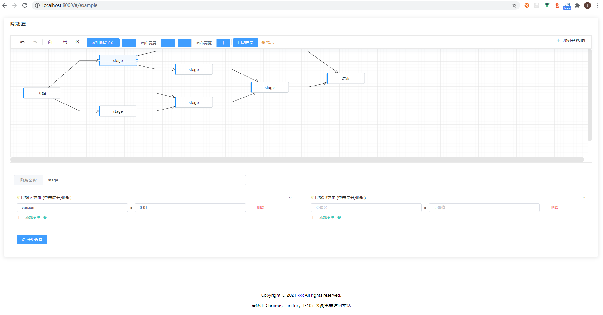
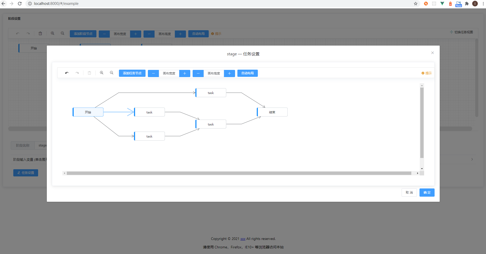

# Pipeline editor

> 基于`@antv/g6`实现的`DAG`图编辑器，适用于流水线逻辑图的编辑。

## Application scenario

- 在`CI/CD`和`DevOps`场景下,`CD`基于持续交付的优势会自动将经过测试的代码推入生产环境;
- 流水线编辑器描述了这一些列步骤，支持分阶段分任务得编辑每个步骤;
- 整个流水线支持用户自定义的任务执行流程，包括几个重要概念:

  - pipeline：流水线，包含一个或多个 stage
  - stage：阶段，包含一个或多个 task
  - task：任务，具体的待执行任务，例如“构建”、“执行命令”、“远程调用”等。

流水线在执行时会将`task`分解成实际在所配置环境上的某台机器上执行的命令-也就是`job`。

## Feature

- 支持节点增加、删除，边连线，右键复制节点等功能
    

- 阶段编辑
    

- 任务编辑
    

- 任务全局视图
    

## Use

## 表示DAG 图的数据模型

- `DAG`图的定义

  > 如果一个有向图无法从某个顶点出发经过若干条边回到该点，则这个图是一个有向无环图。

考虑每一个节点与它的前置节点之间都存在着一个父子关系，最终数据模型如下：

```bash
    {
      pipelineId: 4386,
      postStageIdsMap:  {9776: [9786], 9777: [9787], 9786: [9777], 9787: [-2], -1: [9776], -2: []},
      stages: [
        {
          stageId: 9776,
          postTaskIdsMap: {16956: [-2], -1: [16956], -2: []},
          tasks: [{
            taskId: 16956
            ...
          }]
          ...
        },
      ...
      ],
      ...
    }
```

- 求解第一个状态为非成功状态的节点

应用了有向无环图的拓扑排序，拓扑排序定义如下：

> 拓扑排序是对DAG的顶点进行排序，使得对每一条有向边(u, v)，均有u（在排序记录中）比v先出现。亦可理解为对某点v而言，只有当v的所有源点均出现了，v才能出现。

## 踩坑

### 拖拽事件

在画布指定位置增加节点的功能，监听了拖拽事件，以下是拖拽产生的一系列事件，

```bash
dragstart：开始拖元素触发
dragenter：元素拖进可drop元素（绑定drop事件的元素）时触发
dragover：当元素拖动到drop元素上时触发
drop：当元素放下到drop元素触发，作用在目标元素
dragleave ：当元素离开drop元素时触发，作用在目标元素
drag：每次元素被拖动时会触发
dragend：放开拖动元素时触发，作用在拖动元素上
```
- 问题：拖拽时使用监听`dragend`，在回调参数里获取x,y值来确定节点位置，但在`firefox`上总是获取到相同的x,y值。
- 原因：火狐浏览器`dragend`函数不支持获取真实的x,y值。
- 解决：使用drop事件，而不是`dragend`事件。
